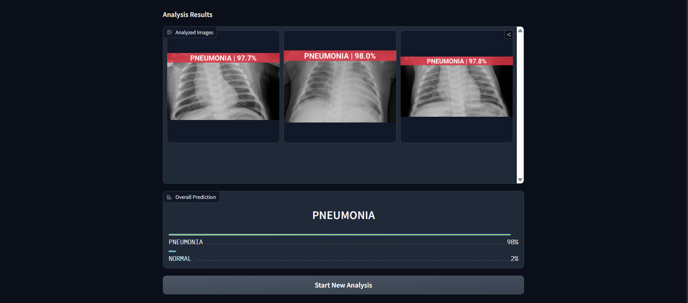

# MLOps End-to-End Project: AI-Powered Pneumonia Detection from Chest X-Rays

 
<!-- Optional: Create a banner image and upload it to a service like imgur.com or directly to your repo -->

**Live Application:** [**https://huggingface.co/spaces/ALYYAN/Pneumonia-Detection-AI**](https://huggingface.co/spaces/ALYYAN/Pneumonia-Detection-AI) <!-- Make sure this link is correct -->

---

## Table of Contents
1.  [Introduction & Problem Statement](#1-introduction--problem-statement)
2.  [Technological Stack](#2-technological-stack)
3.  [MLOps Architecture & Workflow](#3-mlops-architecture--workflow)
4.  [Methodology: The Dual-Model Approach](#4-methodology-the-dual-model-approach)
    -   [4.1 Sanity Check Model: Out-of-Distribution Detection](#41-sanity-check-model-out-of-distribution-detection)
    -   [4.2 Core Diagnosis Model: Fine-Tuned Vision Transformer](#42-core-diagnosis-model-fine-tuned-vision-transformer)
    -   [4.3 Multi-Image Aggregation](#43-multi-image-aggregation)
5.  [Project Structure](#5-project-structure)
6.  [How to Run this Project Locally](#6-how-to-run-this-project-locally)
7.  [Project Team](#7-project-team)

---

## 1. Introduction & Problem Statement

Pneumonia remains a leading cause of mortality among children and the elderly worldwide. A swift and accurate diagnosis is critical for effective treatment, with chest radiography (X-rays) being the most common imaging modality for its detection. However, interpreting these X-rays can be challenging and subject to variability depending on the radiologist's expertise.

This project addresses this challenge by developing a robust, end-to-end deep learning system designed to assist medical professionals by classifying chest X-ray images as either **Normal** or indicative of **Pneumonia**.

The primary goal was not just to build a model, but to engineer a complete, production-ready MLOps pipeline that encompasses everything from data ingestion and versioning to automated training, deployment, and a user-friendly clinical interface. This ensures the system is reproducible, scalable, and reliable.

## 2. Technological Stack

This project integrates a suite of modern tools and frameworks to create a professional-grade application:

*   **Model Development:** PyTorch, Hugging Face `transformers` & `datasets`.
*   **ML Experiment Tracking:** MLflow.
*   **Data & Pipeline Versioning:** DVC (Data Version Control).
*   **Frontend Application:** Gradio.
*   **Database:** MongoDB Atlas (NoSQL Cloud Database).
*   **Image Processing:** Pillow (PIL), NumPy.
*   **CI/CD & Deployment:** GitHub Actions for automation, Hugging Face Spaces for hosting.

## 3. MLOps Architecture & Workflow

The project is built on a robust Continuous Integration/Continuous Deployment (CI/CD) pipeline, ensuring that every change is automatically tested and deployed.

1.  **Local Development:** Code is developed locally in a structured Python package. Experiments are tracked with MLflow, and data/models are versioned with DVC, with Google Drive as remote storage for large artifacts.
2.  **Version Control:** All source code is hosted on GitHub. A `develop` branch is used for experimentation, while the `main` branch is protected and represents the stable, production-ready version.
3.  **Continuous Integration (CI):** When code is pushed to the `main` branch on GitHub, a GitHub Action is automatically triggered.
4.  **Continuous Deployment (CD):** The GitHub Action performs the following steps:
    *   Checks out the source code.
    *   Installs all dependencies from `requirements.txt`.
    *   Builds the application by copying the necessary files (`app.py`, `app/` folder, etc.). The large model file is pulled from Git LFS.
    *   Pushes the complete application bundle to the target Hugging Face Space repository.
5.  **Deployment & Hosting:** Hugging Face Spaces detects the new push, runs a `setup.sh` script to install system-level dependencies (like fonts), and launches the Gradio application, making it publicly accessible.

 
<!-- Optional: Create a simple diagram of this workflow -->

## 4. Methodology: The Dual-Model Approach

To ensure robustness and prevent erroneous predictions on incorrect image types (e.g., a photo of a car), this application employs a sophisticated two-stage prediction pipeline.

### 4.1 Sanity Check Model: Out-of-Distribution Detection

Before any pneumonia-specific analysis occurs, each uploaded image is first passed through a general-purpose, pre-trained image classification model.

*   **Model:** `microsoft/resnet-50`, a powerful model pre-trained on the large ImageNet dataset.
*   **Purpose:** To act as an **out-of-distribution (OOD) detector**. Its job is not to find pneumonia but to answer the question: "Is this image something completely unrelated to a medical scan?"
*   **Logic:** The model predicts the top 5 most likely classes for the input image. We check these predicted labels against a curated list of "forbidden" common object categories (e.g., `car`, `truck`, `cat`, `dog`, `building`). If any of the top predictions match a forbidden term, the image is rejected as invalid. This crucial first step prevents the specialized model from making nonsensical predictions on irrelevant images.

### 4.2 Core Diagnosis Model: Fine-Tuned Vision Transformer

Only images that pass the sanity check are sent to the core diagnostic model.

*   **Model:** `google/vit-base-patch16-224-in21k`. This is a Vision Transformer (ViT) pre-trained by Google on the ImageNet-21k dataset.
*   **Fine-Tuning (Transfer Learning):** The pre-trained model already possesses a powerful, generalized understanding of visual features. We fine-tuned this model on the "Chest X-Ray Images (Pneumonia)" dataset. This process specializes the model's expert knowledge for the specific task of identifying the subtle patterns, opacities, and infiltrates characteristic of pneumonia.
*   **Result:** This fine-tuning process allows the model to achieve high accuracy (over 94% on the test set) with only a few epochs of training, leveraging the immense knowledge base of the original model.

### 4.3 Multi-Image Aggregation

The application allows for the upload of up to three images for a single patient. To provide a single, robust final diagnosis, the following aggregation strategy is used:

1.  Each valid image is passed through the model individually to obtain its raw output scores (logits).
2.  The logits from all images are then **averaged**.
3.  A softmax function is applied to this averaged logit vector to calculate the final, aggregated confidence scores for "Normal" and "Pneumonia".

This method ensures that the final prediction is a consensus of all available evidence, making it more resilient to single-image anomalies or low-quality scans.

## 5. Project Structure

├── app/ # Gradio application files
│ ├── database.py # MongoDB connection and functions
│ ├── image_utils.py # Watermarking logic
│ ├── prediction.py # Dual-model prediction pipeline
│ └── Roboto-Bold.ttf # Bundled font for watermarking
│
├── src/vitClassifier/ # Training pipeline (DVC, MLflow)
│
├── .github/workflows/ # CI/CD pipeline (main.yml)
│
├── artifacts/ # Local storage for models (ignored by Git)
│
├── .gitignore
├── app.py # Main Gradio app entrypoint
├── dvc.yaml # DVC pipeline definition
├── requirements.txt # Python dependencies
└── README.md # Project documentation

## 6. How to Run this Project Locally

1.  **Prerequisites:** Git, Python 3.11+, DVC, and Git LFS must be installed.
2.  **Clone the repository:**
    ```bash
    git clone https://github.com/AlyyanAhmed21/Chest-X-ray-Pneumonia-Detection-with-ViT.git
    cd Chest-X-ray-Pneumonia-Detection-with-ViT
    ```
3.  **Set up the environment:**
    ```bash
    python -m venv venv
    source venv/bin/activate  # On Windows: venv\Scripts\activate
    pip install -r requirements.txt
    ```
4.  **Set up credentials:**
    *   Create a `.env` file in the root directory.
    *   Add your `MONGODB_CONNECTION_STRING` to this file.
5.  **Run the application:**
    ```bash
    python app.py
    ```
6.  Open the local URL provided (e.g., `http://127.0.0.1:7860`) in your browser.

## 7. Project Team

*   **Alyyan Ahmed:** Lead ML Engineer & Full-Stack Developer
*   **Munim Akbar:** Project Contributor & Code Reviewer

---
